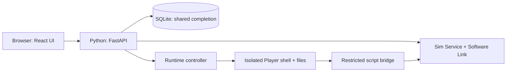

# Knight Sat Sim: project plan

This is the short product and team overview. First [run the project](../../README.md#run-locally); then follow [Contributing](../../CONTRIBUTING.md) for the ticket-to-deployment steps. The [documentation map](../README.md) helps you choose the detailed spec for your work.

## MVP: what "done" means

The MVP (minimum viable product) is the version we promise to finish. Everything else is a stretch goal.

**Required for the MVP**

1. Three Basic operations Challenges, played in this order on the team's hosted website in desktop Google Chrome:
   - **Hello, Satellite!** Run a supplied command in the browser terminal, send PING to the simulated satellite and recognize its reply.
   - **Ready for the Pass:** Read a pass brief, fix a mistaken station setting in a form and pass the setup check.
   - **Catch and Log:** Adapt a short Python starter to receive a simulated pass, save a recording and fill in a session log.
2. An in-browser terminal and code editor, running learner code in an isolated container.
3. Our own small Python satellite simulator, using our [packet format](packet-format-v1.md).
4. The server decides which Challenges are unlocked and saves completion before the website shows success.
5. Only approved teammates can reach the website (email-code sign-in).
6. A file browser, notes and downloads, built after the three Challenges work.
7. A newcomer completes all three Challenges and we record how long it took, which checks failed and where they got stuck.

**Stretch goals (not promised)**

- The Offensive and Defensive tracks, including a redesigned Replay Challenge and attack-detection metrics.
- PSB station lessons based on the real station's equipment and procedures.
- Robustness work for a public or multi-user service, listed in [later hardening](later-hardening.md).
- Real radios, accounts, several players at once, leaderboards and a free-play Sandbox.

## How the parts fit

The browser shows controls and results. FastAPI checks requests, saves progress and runs one Player **session** at a time. The Sim owns satellite behavior. SQLite saves shared completion. The controller runs Player programs in an isolated container; those programs reach only the simulation through the bridge.

This diagram shows the target connections. Today the server answers only `/health`; the runtime controller, bridge and automatic deployment are built. Jira records what remains.

## Goal

Build a Platform where people can practice satellite cybersecurity and learn to operate a ground station, including our station at UCF’s Physical Sciences Building (PSB).

Players will learn how the station works, practice operating it in software, and try cybersecurity Challenges against the Satellite Sim.

The product has three tracks: **Basic operations**, **Offensive**, and **Defensive**. The MVP is three Basic operations Challenges, starting with **Hello, Satellite!** Offensive and Defensive Challenges, including redesigned Replay, are stretch goals. Basic operations teaches ground-station fundamentals and builds toward the PSB equipment and workflow.

## Learner background

This section describes the person using the training product. Contributors can be new to web development; repository setup and ticket instructions explain the project workflow without requiring AI.

Assume some basic Python familiarity. This is a ground-station operations and satellite-security Platform, not a Python course. Give concise instructions for the supplied tools, file formats and project-specific interfaces; do not add lessons on general Python syntax. Station/RF knowledge is still taught from the basics. Running or editing Python is appropriate where it serves an operational task, without forcing code into every interaction.

## First software demo

The MVP contains exactly three Basic operations Challenges:

| Order | Challenge | Agreed scope |
| --- | --- | --- |
| 1 | **Hello, Satellite!** | Run a supplied terminal command, send PING and recognize the Satellite Sim's reply. Hello does not require writing a script. |
| 2 | **Ready for the Pass** | Check satellite, pass time, receiving frequency and receiving mode using graphical controls; enable automatic tracking. Use Check setup feedback to correct the mistaken setting. |
| 3 | **Catch and Log** | Adapt a short Python starter to receive telemetry and save a recording. Use the supplied decoder to extract readings, then complete and save the session-log template. |

Ready for the Pass and Catch and Log describe the same fictional practice pass. Catch always starts from the correct station setup, so it can be repeated without redoing Ready. The simulated pass starts when the Player clicks Start pass, rather than waiting for real time. The [operations curriculum](ground-station-training.md#mvp-operations-curriculum) owns the interactions and success criteria.

Delivery constraints: browser-based practice, current stable desktop Google Chrome, one session at a time, local teammate development and a shared team-only hosted URL. Cloudflare Access email codes admit approved teammates; there are no individual Platform accounts and progress is shared. Diab maintains the hosting environment privately; contributors need only the approved development URL. The [deployment spec](backend-and-simulation.md#ownership-and-deployment) owns that foundation.

Hello uses the Software Link, not a real spacecraft. Ready for the Pass and Catch and Log use a fictional pass brief and supplied synthetic telemetry; the Player creates a packet recording. The [pass defaults](ground-station-training.md#implementation-defaults-practice-pass-and-evidence) define the fixture, files and checks.

Decoding packet fields does not teach RF demodulation. No live radio or station hardware is part of the MVP.

Hello uses the terminal. Ready for the Pass is a form and needs no terminal. Catch and Log uses the editor and terminal for a short Python script and a saved log. Scripts run inside the website; scripts on a Player's own computer are not supported.

## Challenge progression

Organize activities into the three tracks rather than one security ladder. Basic operations is the only playable MVP track.

Each Challenge has a Briefing, a practical learning goal and a Debrief. Completion is task-based: the server checks the required actions/results, saves completion, then shows what the Player accomplished. There are no Flags to copy or submit.

Unlock Hello → Ready for the Pass → Catch and Log using shared progress. Completed Challenges stay available to repeat. Availability and completion are enforced by the server.

During development, the server can unlock every Challenge (see [storage defaults](backend-and-simulation.md#implementation-defaults-simulation-and-storage)) so the team can build Ready before Hello. This never saves completion.

KnightSat remains a fictional student CubeSat, separate from any real KSC spacecraft and the PSB station. Explain technical terms in plain language. There are no points, leaderboards or badges in this course year. Completing simulated training records practice; it does not certify a Player to operate real equipment alone.

## Ground-station training

We want someone new to ground stations to understand the equipment and practice a station session before using the real PSB station. This is a stretch goal beyond the three MVP Challenges.

The lessons should cover:

- What the antennas, pointing controls, radios, and computers do.
- How to prepare for a satellite pass and choose the right equipment and settings.
- How to follow a pass, receive and decode a signal, save the results, troubleshoot problems, and finish the session.
- How those steps work at PSB, using its actual equipment names, photos, software screens, and station guide.

We’ll build toward a full receive-only station session, including decoding, using simulated or recorded data for practice. The PSB guide is still being written. Diab will help write and check its procedures with someone familiar with the station. Completing a software lesson records practice; using the real equipment still involves a station walkthrough with an experienced operator.

The [ground-station training plan](ground-station-training.md) lists the lessons, source material, and remaining questions. Connecting the Platform to live station hardware is separate work.

## Who owns what

Each ticket has one accountable owner. Each pair owns something a Player can see working, from the screen down to the server, rather than one layer each.

| Who | Owns | A Player can see |
| --- | --- | --- |
| Sydney (frontend) and Kamilla (backend) | **Ready for the Pass**: Challenge list, station form, setup check and saved progress. Then Catch's Check work and results. | The Challenge list with locks, the Ready form, its feedback and the unlock that follows. |
| Lily (frontend) and Denzel (backend) | **The terminal for Hello**: terminal panel and its server connection. Then the editor and file saving for Catch, then the file browser, notes and downloads. | Typing in a real terminal, then editing and saving a script. |
| Kamilla, paired with Diab | The session layer: start one session, read its state, stop it. | Start and Stop buttons that work. |
| Diab | The simulator, packet tools, Catch's simulated pass, deployment and hosting, startup cleanup, and the hard parts of integration. Reviews and unblocks everyone. PSB content. | The satellite answering PING; the pass arriving. |

Coordinate before changing a shared file or interface. If you are stuck for a day, ask Diab.

Everyone tests and documents their own work. We track tasks in the Knight Sat Sim (KSAT) Jira project. Follow the [contribution review rules](../../CONTRIBUTING.md#planning-and-board), including Diab's authorization for his own merges; do not preassign a fixed reviewer. RF hardware work comes later.

## How we’ll build it

We build the Challenges in a different order from the one Players use, so that the simplest Challenge works first:

1. **Foundations:** Diab's simulator and packet code; Kamilla's progress storage and Challenge list; Sydney's catalogue screen; Lily and Denzel's terminal panel and server connection, tested on their own.
2. **Ready for the Pass:** the station form, the setup check and saved progress. It needs no session, terminal or simulator.
3. **Hello, Satellite!:** start/read/stop one session, the terminal in a real session, the PING tool and saved completion.
4. **Catch and Log:** the simulated pass, the editor saving files, Check work and saved completion.
5. **Files and walkthrough:** the file browser, notes and downloads; then a newcomer completes all three Challenges on the hosted site while we record learner measures.

Players still play Hello → Ready → Catch. Track real prerequisites with Jira blocking links; a Player's unlock order does not block development.

The official repository is [`senior-design-organization/knights-sat-sim`](https://github.com/senior-design-organization/knights-sat-sim), imported with all Git branches and history from the personal repository. Historical pull requests and CI evidence remain at their original URLs. The agreed baseline was originally published to `kamillamamatova/knight-sat-sim`, at [c7e742a](https://github.com/kamillamamatova/knight-sat-sim/commit/c7e742a0b663a97694f5691bf1a3773fdca3ba07).

We plan in two-week Jira sprints, starting Monday 5 October 2026. Keep the four epics for foundation, Workspace, Challenges and hosting; use area labels to find UI, server, simulation, hosting and documentation work. Course documents and learning tutorials are tickets too. The [contribution rules](../../CONTRIBUTING.md#planning-and-board) own the sprint routine, ticket format and review procedure. Dates and task status belong in Jira.

PSB procedure research can proceed separately; unverified real-station instructions do not block the simulated MVP.

## Completion checks

These are implementation acceptance requirements, not completed results.

- [ ] All three Basic operations Challenges work in order, with server-enforced unlocks and repeats of completed activities.
- [ ] Hello verifies a real PING/reply; Ready verifies the submitted setup; Catch verifies a saved recording and factual session log.
- [ ] Completion is saved before success/unlock is shown, with a Debrief and no Flag step.
- [ ] The terminal and editor work in a real isolated session; the file browser, notes and downloads work.
- [ ] A newcomer with basic Python familiarity completes the activities in Chrome and explains their operational purpose. We record their time to finish, failed checks and where they got stuck.
- [ ] Approved teammates can use the hosted demo with shared progress; others are refused by the access gate.
- [ ] Simulation is clearly labelled; no unverified PSB procedure or stretch-goal activity is required.

Final acceptance is a real browser using the real server, simulator, SQLite database and Player container. Use Playwright with Google Chrome for browser checks where useful; pytest and Vitest cover focused behavior.

## Tools and later work

We’re building a custom web Platform and a small Python Satellite Sim; the [simulator trade study](../research/simulator-trade-study.md) explains why we did not build on an existing simulator. The frontend uses React and TypeScript; the backend uses Python and FastAPI; SQLite stores progress; Docker runs Player code. The Web Backend and Sim Service share one server process. The [Sim Service contract](backend-and-simulation.md#ownership-and-deployment) defines their responsibilities, and the [Workspace contract](terminal-workspace.md#execution-storage-and-endpoint-isolation) defines Player execution.

Stretch and later work includes the Offensive and Defensive tracks, real radios, orbital physics, more Challenges, free-play Sandbox, switchable Defenses, accounts, multiple Players at once, leaderboards and the [later hardening](later-hardening.md) list. Installing extra packages and unrestricted internet access from the terminal are also outside the first version.

### Later tracks

The Offensive track may include redesigned Replay and unauthorized commanding. The Defensive track may include detecting suspicious commands and demonstrating protections. Specific activities, their sequence and whether they share scenarios are deferred. A meaningful consequence and a visible Defense remain the direction for a future Replay redesign; its previous antenna-counter exercise is not approved as that redesign.

Attack-detection metrics (for example, how often a Defense catches a replayed or forged command) only become meaningful once the simulated Link can drop and reorder packets. The MVP Link delivers everything in order, so these metrics wait for that work.

Real radios, live hardware integration and advanced station lessons need their own requirements. The [station training plan](ground-station-training.md) supplies the broader operations goals.

## Build specifications

| Area | Read this |
| --- | --- |
| Shared UI components, styling, and desktop support | [Frontend](frontend.md) |
| Sessions, simulation, progress, task completion and hosting | [Backend and simulation](backend-and-simulation.md) |
| Packet bytes, encoding, and parsing | [Packet format](packet-format-v1.md) |
| Terminal, editor, files, and Player containers | [Terminal Workspace](terminal-workspace.md) |
| Ready for the Pass, Catch and Log, and broader PSB lessons | [Ground-station training](ground-station-training.md#mvp-operations-curriculum) |
| Guided PING instructions, goal, and checks | [Hello, Satellite](challenges/01-hello-satellite.md) |
| Robustness deliberately left out of the MVP | [Later hardening](later-hardening.md) |

The [glossary](../glossary.md) defines shared terms, and [Contributing](../../CONTRIBUTING.md) covers tests and review. Record agreed choices in the spec that owns them; dates and task assignments belong in Jira. Do not add separate decision records. Package versions belong in lockfiles, running/setup instructions in README, and task status in Jira.
